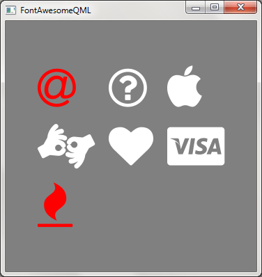

# FontAwesomeQML

A FontAwesome wrapper for QML(Qt Quick)

About Font Awesome: [http://fontawesome.io/](http://fontawesome.io/)

Thanks everyone for the awesome gift!

This project is tested under: Qt 4.8.6 and FontAwesome 4.6.1

## Usage

* all your need are placed under **'fa-qml'**, copy it to your project
* add the **QML files** and the **font('fontawesome-webfont.ttf')** under 'fa-qml' to your *.qrc file(if you are using the qrc stuff)
* **import "fa-qml"** and enjoy it

### Example

This example is written in Qt4.8 with QtQuick1.1. You may need to do some modifications if you are using different version of Qt.

```qml

import QtQuick 1.1
import "fa-qml" as Awesome

Rectangle {
    width: 360
    height: 360

    Awesome.Loader {
        id: awesome
        source: "qrc:///fa-qml/fontawesome-webfont.ttf"
    }

    Awesome.Icon {
        anchors.centerIn: parent

        color: "red"
        size: 48
        icon: awesome.fa_at
    }
}

```

### Screenshot:



## More

There are two files you may not use under 'fa-qml':

1. fa-cheatsheet.html
2. fa-qml-gen.py

These two files are used to generate the 'Loader.qml', which maintains the mapping between "fa icon name" and the unicode value. 

See also: [http://fontawesome.io/cheatsheet/](http://fontawesome.io/cheatsheet/) (actually, "fa-cheatsheet.html" is the source code of this page)

You can modify them if you are using other version of Font Awesome or Qt.

Have fun!
