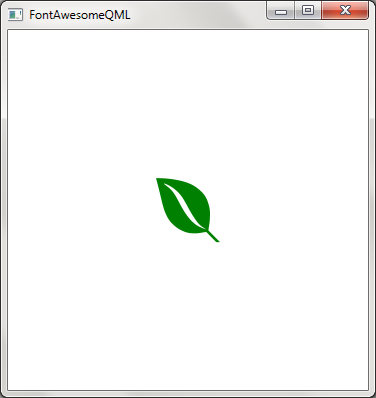

# FontAwesomeQML

A FontAwesome wrapper for QML(Qt Quick)

About Font Awesome: [http://fontawesome.io/](http://fontawesome.io/)

Thank everyone for the awesome gift!

This project is tested under: Qt 4.8.6 and FontAwesome 4.6.1

## Usage

* all your need are placed under **'fa-qml'**, copy it to your project
* add the **QML files** and the **font('fontawesome-webfont.ttf')** under 'fa-qml' to your *.qrc file(if you are using the qrc stuff)
* **import "fa-qml"** and enjoy it

### Example

This example is written in Qt4.8 with QtQuick1.1. You may need to do some modifications if you are using different version of Qt.

```qml

import QtQuick 1.1
import "fa-qml" as Awesome

Rectangle {
    width: 360
    height: 360

    Awesome.Loader {
        id: awesome
        source: "qrc:///fa-qml/fontawesome-webfont.ttf"
    }

    Awesome.Icon {
        id: awesomeIcon
        anchors.centerIn: parent
        color: "green"
        icon: awesome.fa_envira
    }
}


```

### Screenshot:



## More

There is a Python script you maybe interest in:

	fa-qml-gen.py

This file is used to generate the 'Loader.qml'(with header 'import QtQuick 1.1'), which maintains the mapping between "fa icon name" and the unicode value. You should modify it if you are using other version of Qt.

See also: [http://fontawesome.io/cheatsheet/](http://fontawesome.io/cheatsheet/) 

Have fun!
